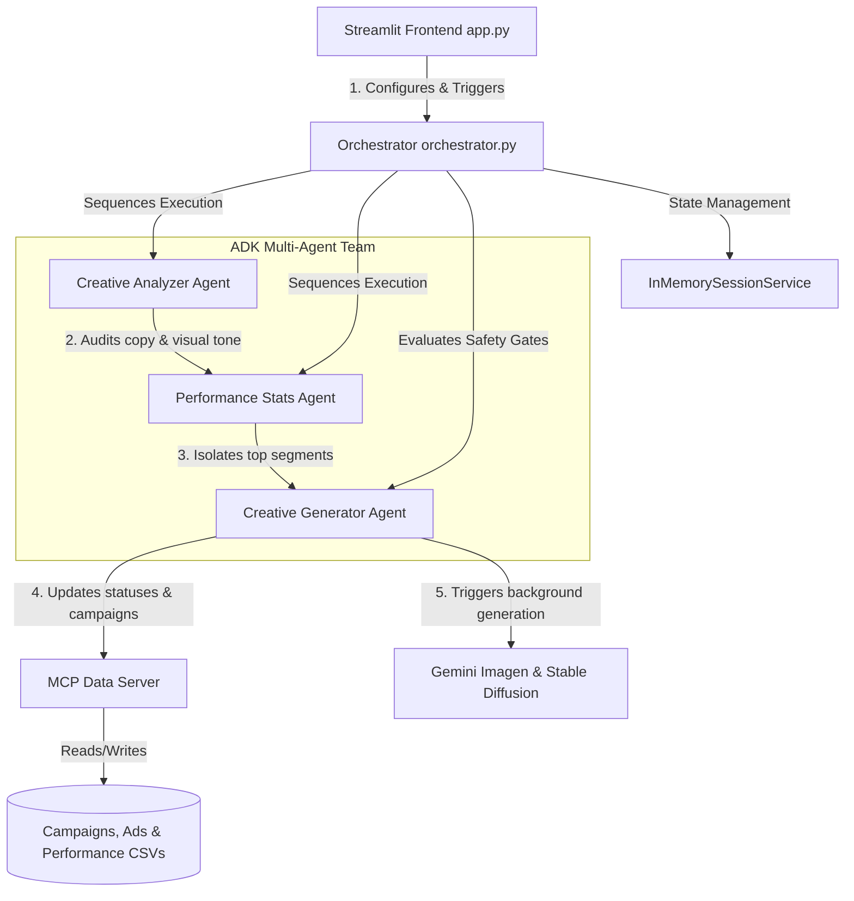

# ⚡ AdTech Multi-Agent Ad Optimizer

This repository houses the Capstone Project submission for the **5-Day AI Agents: Intensive Vibe Coding Course With Google**. 
For details, refer to the [Kaggle Competition & Capstone Discussion page](https://www.kaggle.com/competitions/5-day-ai-agents-intensive-vibecoding-course-with-google/discussion/709721).

A robust, closed-loop display ad optimization framework constructed using **Google ADK (Agent Development Kit)**, **Gemini 2.5 Flash**, **Gemini Imagen**, and **Streamlit**. 

This system automates the digital creative audit process, evaluates performance metrics across key device and time segments, and applies real-time optimization modifications (such as pausing low-performing ads, composing high-performing copy variants, generating matching ad imagery, and refining target audience demographics) while enforcing strict operating guardrails.

---

## 🏗️ Project Architecture

The framework consists of four decoupled, modular components:



### 1. The MCP Data Server (`mcp_server/server.py`)
Mediate all agent interactions with CSV database stores over standard Model Context Protocol (stdio). Exposes:
* `get_campaigns` & `get_ads`
* `get_performance_summary` (aggregates raw metrics like clicks, impressions, and conversions grouped by `device` and `time_of_day`)
* `update_ad_status` (updates status and validates inputs)
* `create_ad` (handles sequential ID assignment and inserts new copywriting records)
* `update_campaign_targeting` (narrows campaign targeting dimensions based on high-performing segments)

### 2. Specialized ADK Agents (`agents/`)
* **Creative Analyzer (`agents/creative_analyzer.py`)**: Scores headlines, body copy, and tone (0–100 quality scale) and flags visual layout improvements.
* **Performance Stats (`agents/performance_stats.py`)**: Analyzes CTR, conversions, and ROAS parameters against the campaign's target objective (awareness, traffic, or conversions).
* **Creative Generator (`agents/creative_generator.py`)**: Executes optimization actions. It pauses underperforming variants, creates new copywriting copies, and generates a fresh, professional product/lifestyle visual banner (utilizing Gemini Imagen API or falling back to local Stable Diffusion v1.5).

### 3. Orchestration & ADK Skill (`orchestrator.py` & `skills/optimize_campaign.py`)
* The orchestrator chains session states via `InMemorySessionService`.
* Contains an **Active Ads Guardrail** which intercepts generator tool calls and blocks modifications if the campaign has 1 or fewer active ads left, avoiding campaign downtime.
* Exposes the complete multi-agent pipeline under a single callable function `optimize_campaign(campaign_id)` inside the ADK Skill wrapper.

### 4. Dark-Themed Streamlit Control Center (`app.py`)
* Provides an operational dashboard to configure and trigger optimization runs.
* Features a side-by-side comparative diff of paused vs. newly generated ads.
* Highlights the selected campaign row in a beautiful premium light purple background theme.
* Contains a dedicated **Campaign Performance Report Page** displaying the raw ad performance dataset and the filtered raw ads table.

---

## 🔒 Safety, Guardrails & Visual Tuning

* **Active Ads Gatekeeper**: Prevents automated scripts from pausing ads if it would leave the campaign with zero active creatives.
* **MPS Float32 Visual Safety**: The local Stable Diffusion pipeline is forced to execute using `float32` precision on Apple Silicon (MPS) systems. This avoids the common `float16` attention-layer NaN bugs that result in completely black images.
* **Clean Ad Imagery**: Generates clean, professional background images and product assets without any overlaid text to keep the aesthetic clean and uncluttered.
* **Free Tier Cooldown Hook**: The agent configurations utilize a callback cooldown layer (12-second async sleep) to guarantee execution safety when running under Gemini API Free Tier RPM limits.
* **Interactive Confirmation Gate**: The main optimization launch button is locked behind a parameter verification check to prevent accidental triggers.

---

## 🚀 Getting Started

### 1. Environment Setup
Clone this repository and create a Python virtual environment:
```bash
python -m venv .venv
source .venv/bin/activate
```

Install the dependencies:
```bash
pip install -r requirements.txt
```

### 2. Configure Environment Variables
Copy the template `.env.example` file to `.env`:
```bash
cp .env.example .env
```
Open `.env` and paste your actual Google Gemini API key:
```env
GEMINI_API_KEY=your_actual_gemini_key_here
```

### 3. Launch the Application
Run the Streamlit frontend locally:
```bash
.venv/bin/python -m streamlit run app.py
```
*Note: The app will automatically seed the `data/` directory with sample campaigns, ads, and performance metrics on first launch if they do not already exist.*

### 4. How to Use the Simulation
1. Open the local address [http://localhost:8501](http://localhost:8501).
2. Review the campaigns table. Select a campaign row (it will highlight in purple).
3. Under the **Run an Optimization** control panel, choose an optimization focus (Awareness, Conversion, or Traffic).
4. Click the glowy **Launch Optimization** button.
5. Watch the animated Multi-Agent flow trace its actions (Auditing, Aggregating, Generating).
6. View the visual changes side-by-side, or click **"View"** in the report column of the campaigns table to inspect raw campaign datasets and active/paused ads.
7. Click **"Reset Data"** next to the launch button to restore all data tables to their original baseline state at any time.
